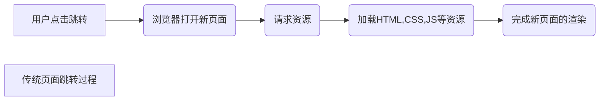
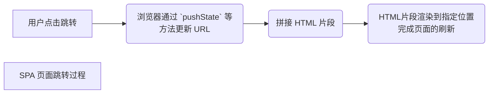

# [前端工程化](https://vue3.chengpeiquan.com/engineering.html)

## 现代化开发概念🏙

### MPA与SPA

| 名词 |          全称          |    中文    |
| :--: | :---------------------: | :--------: |
| MPA | Multi-Page Application | 多页面应用 |
| SPA | Single-Page Application | 单页面应用 |

#### 多页面应用(传统)

##### MPA优点

- 首屏加载快

  在不考虑额外的 CSS 、 图片加载速度的情况下，呈现速度最快
- SEO友好

  除了TKD三要素外，网页内容页影响收录的关键因素

  > 网页的 TKD 三要素是指一个网页的三个关键信息，含义如下：
  >
  > T ，指 Title ，网站的标题，即网页的 `<title>网站的标题</title>` 标签。
  >
  > K ，指 Keywords ，网站的关键词，即网页的 `<meta name="Keywords" content="关键词1,关键词2,关键词3" />` 标签。
  >
  > D ，指 Description ，网站的描述，即网页的 `<meta name="description" content="网站的描述" />` 标签。
  >
  > 这三个要素标签都位于 HTML 文件的 `<head />` 标签内。
  >
- 易与服务器语言结合

  传统页面由服务端直出，可用非前端语言编写页面模版，最终输出HTML也页面到服务器访问。

##### MPA缺点

- 页面间跳转访问慢

  由访问流程可知每次页面访问都要完整经理一次渲染过程
- 用户体验不友好

  如果网页上的资源较多或者网速不好，这个过程就会有明显的卡顿或者布局错乱，影响用户体验。
- 开发成本高

  传统的多页面模式缺少前端工程化的很多优秀技术栈支持，工作量大且无法做到前后端分离来利用好跨岗位协作

#### 单页面应用

SPA 项目实际上只有一个 HTML 文件，也就是 `index.html` 首页文件。只有第一次访问的时候才需要经历一次完整的页面请求过程，之后的每个内部跳转或者数据更新操作，都是通过 AJAX 技术来获取需要呈现的内容并只更新指定的网页位置。

> AJAX 技术（ Asynchronous JavaScript and XML ）是指在不离开页面的情况下，通过 JavaScript 发出 HTTP 请求，让网页通过增量更新的方式呈现给用户界面，而不需要刷新整个页面来重新加载，是一种 “无刷体验” 。

SPA 在页面跳转的时候，地址栏也会发生变化，主要有以下两种方式：

1. 通过修改 [Location:hash](https://developer.mozilla.org/zh-CN/docs/Web/API/Location/hash) 修改 URL 的 Hash 值（也就是 `#` 号后面部分），例如从 `https://example.com/#/foo` 变成 `https://example.com/#/bar`
2. 通过 History API 的 [pushState](https://developer.mozilla.org/zh-CN/docs/Web/API/History/pushState) 方法更新 URL ，例如从 `https://example.com/foo` 变成 `https://example.com/bar`

##### SPA优点

- 仅一次完全请求等待时间(首屏加载)
- 切换页面速度快
- 页间切换支持动画
- 开发效率高，前后端分离，后端负责API接口，前端负责页面和联调

##### SPA缺点

- 首屏加载慢

  打开首页后还要根据路由再执行一次内容渲染
- 不利于SEO优化

  SPA应用全程由JavaScript控制内容渲染，唯一HTML页面 `index.html` 通常是空的页面，无法设置每个路由页面的TDK，呈现页面内容并让搜索引擎爬取

### CSR与SSR

| 名词 |         全称         |    中文    |
| :--: | :-------------------: | :--------: |
| CSR | Client-Side Rendering | 客户端渲染 |
| SSR | Server-Side Rendering | 服务端渲染 |

#### 客户端渲染

利用 AJAX 技术，把渲染工作从服务端转移到客户端完成(大部分情况下， CSR 等同于 SPA ，包括实现原理和优势)

**优点**：客户端的用户体验更好，前后端分离的开发模式更加高效。

**缺点**：首屏加载较慢、不利于 SEO 优化

#### 服务端渲染

使用 Node.js 作为服务端技术栈

利用的同构渲染方案（ Isomorphic Rendering ），一套代码不仅可以在客户端运行，也可以在服务端运行，在一些合适的时机先由服务端完成渲染（ Server-Side Rendering ）再直出给客户端激活（ Client-Side Hydration ），这种开发模式带来了：

- 更好的SEO支持，解决了SPA单页缺陷
- 更快的首屏加速，保持了MPA多页面应用的优点
- 仍支持前后端分离
- 提高客户端体验，完全打开页面后，本地访问过程也可以保持SPA单页面的体验
- 统一心智模型，支持同构，没有额外心智负担

### Pre-Rendering 与 SSG

|     名词     |          全称          |     中文     |
| :-----------: | :--------------------: | :----------: |
| Pre-Rendering |     Pre-Rendering     |    预渲染    |
|      SSG      | Static-Site Generation | 静态站点生成 |

#### 预渲染

在构建的时候启动无头浏览器（ Headless Browser ），加载页面的路由并将访问结果按照路由的路径保存到静态 HTML 文件里，这样部署到服务端的页面，不再是一个空的 HTML 页面，而是有真实内容的存在，但由于只在构建时运行，因此用户每次访问的时候 HTML 里的内容不会产生变化，直到下一次构建。

> 无头浏览器（ Headless Browser ），指没有 GUI 界面的浏览器，使用代码通过编程接口来控制浏览器的行为，常用于网络爬虫、自动化测试等场景，预渲染也使用它来完成页面的渲染，以获取渲染后的代码来填充 HTML 文件。

预渲染只在构建时即完成页面内容输出（发生在用户请求前），构建后不论用户何时访问，HTML文件内容都为构建时内容。

因此适用于一些简单的、有一定的 SEO 要求但对内容更新频率没有太高要求、内容多为静态展示的页面。例如企业用于宣传的官网页面、营销活动的推广落地页。[通过 Vite 的内置功能来实现预渲染](https://github.com/chengpeiquan/vite-vue3-prerender-demo)

#### 静态站点生成

SSG 静态站点生成是基于预渲染技术，通过开放简单的 API 和配置文件，就让开发者可以实现一个预渲染静态站点的技术方案。

SSG 静态站点生成器有：基于 Vue 技术的 [VuePress](https://github.com/vuejs/vuepress) 和 [VitePress](https://github.com/vuejs/vitepress) ，自带了 Vue 组件的支持，还有基于 React 的 [Docusaurus](https://github.com/facebook/docusaurus) ，以及很多各有特色的生成器，例如 [Jekyll](https://github.com/jekyll/jekyll) 、 [Hugo](https://github.com/gohugoio/hugo) 等等。

### ISR和IDR

| 名词 |               全称               |       中文       |
| :--: | :------------------------------: | :--------------: |
| ISR |    Incremental Site Rendering    | 增量式的网站渲染 |
| DPR | Distributed Persistent Rendering | 分布式的持续渲染 |

ISR 增量式的网站渲染，通过区分 “关键页面” 和 “非关键页面” 进行构建，优先预渲染 “关键页面” 以保证内容的最新和正确，同时缓存到 CDN ，“非关键页面” 则交给用户访问的时候再执行 CSR 客户端渲染，并触发异步的预渲染缓存到 CDN 。

DPR 分布式的持续渲染则是为了解决 ISR 方案下可能访问到旧内容的问题

## 构建工具

### 基础功能

- 语言转换/编译

> Polyfill ，在浏览器不支持的情况下实现某个功能的代码

由于 JavaScript 允许更改 prototype ，Polyfill 的原理就是先检查浏览器是否支持某个方法，当浏览器不支持的时候，会借助已经被广泛支持的方法来实现相同的功能，达到在旧浏览器上也可以使用新方法的目的。

Polyfill 会考虑到多种异常情况，最大幅度保证浏览器的兼容支持，在通过 [Babel](https://github.com/babel/babel) 一类方案维护方法兼容性

- 代码可以复用，可以直接抽离成 [模块](https://vue3.chengpeiquan.com/engineering.html#学习模块化设计) 、 [组件](https://vue3.chengpeiquan.com/engineering.html#认识组件化设计) ，交给构建工具去合并打包
- 可以使用 Sass 、 Less 等 [CSS 预处理器](https://vue3.chengpeiquan.com/component.html#使用-css-预处理器) ，利用它们的变量支持、混合继承等功能提高开发效率，最终交给构建工具去编译回 CSS 代码
- ...

### Vue3构建工具

---

#### Webpack

插件最全面，支持版本最全面

#### Vite

主打更轻、更快的开发体验，主要面向现代浏览器

#### 二者区别

- Webpack 会先打包，再启动开发服务器，访问开发服务器时，会把打包好的结果直接给过去
- Vite 是基于浏览器原生的 ES Module ，所以不需要预先打包，而是直接启动开发服务器，请求到对应的模块的时候再进行编译

#### 开发环境和生产环境

##### 开发环境

测试代码可行性

- 可以使用 TypeScript 、 CSS 预处理器之类的需要编译的语言提高开发效率
- 提供了热重载（ Hot Module Replacement ， 简称 HMR ），当修改了代码之后，无需重新运行或者刷新页面，构建工具会检测的修改自动帮更新
- 代码不会压缩，并有 Source Mapping 源码映射，方便 BUG 调试
- 默认提供局域网服务，无需自己做本地部署
- ...

##### 生产环境

- 代码会编译为浏览器最兼容的版本，一些不兼容的新语法会进行 [Polyfill](https://developer.mozilla.org/zh-CN/docs/Glossary/Polyfill)
- 稳定，除非重新发布，否则不会影响到已部署的代码
- 打包的时候代码会进行压缩混淆，缩小项目的体积，也降低源码被直接曝光的风险

##### 环境判断

在 Webpack ，可以使用 `process.env.NODE_ENV` 来区分开发环境（ development ）还是生产环境（ production ），它会返回当前所处环境的名称。

在 Vite ，还可以通过判断 `import.meta.env.DEV` 为 `true` 时是开发环境，判断 `import.meta.env.PROD` 为 `true` 时是生产环境（这两个值永远相反）。

|  工具  |                             文档                             |
| :-----: | :----------------------------------------------------------: |
| Webpack |        [模式](https://www.webpackjs.com/concepts/mode/)        |
|  Vite  | [环境变量和模式](https://cn.vitejs.dev/guide/env-and-mode.html) |
