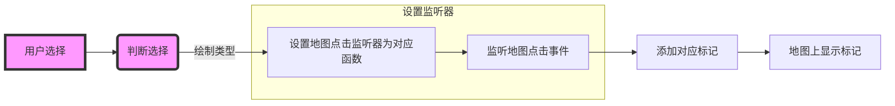

# 在地图上绘制

## 添加Spinner

在 `layout/activity_main.xml` 文件中添加一个 Spinner 控件用于选择要绘制的形状。

```xml
<Spinner
    android:id="@+id/shapes_spinner"
    android:layout_width="wrap_content"
    android:layout_height="wrap_content"
    android:background="@color/white"
    app:layout_constraintTop_toTopOf="parent"
    />
```

### 定义绘制形状数组

在 `res/values/array.xml` 文件中定义一个字符串数组，包含用户可以选择的不同形状类型。

```xml
<?xml version="1.0" encoding="utf-8"?>
<resources>
    <string-array name="shapes_array">
        <item>绘制</item>
        <item>点</item>
        <item>线</item>
        <item>圆弧</item>
        <item>圆</item>
        <item>多边形</item>
        <item>文字</item>
    </string-array>
</resources>
```

## 实现逻辑

在 MainActivity 中，根据用户选择的不同形状类型，设置相应的地图点击监听器，在地图上添加相应的标记。



```java
// 获取布局文件中的 Spinner 控件
Spinner shapesSpinner = findViewById(R.id.shapes_spinner);

// 创建适配器，使用名为 "shapes_array" 的字符串数组作为数据源，并使用系统提供的简单 Spinner item 布局
ArrayAdapter<CharSequence> adapter = ArrayAdapter.createFromResource(this,
        R.array.shapes_array, android.R.layout.simple_spinner_item);

// 设置下拉列表的样式
adapter.setDropDownViewResource(android.R.layout.simple_spinner_dropdown_item);

// 将适配器设置给 Spinner 控件，以显示可选项
shapesSpinner.setAdapter(adapter);

// 设置 Spinner 的选中事件监听器
shapesSpinner.setOnItemSelectedListener(new AdapterView.OnItemSelectedListener() {
    @Override
    public void onItemSelected(AdapterView<?> parent, View view, int position, long id) {
        // 当用户选择某个选项时执行的操作
        String selectedItem = parent.getItemAtPosition(position).toString();
  
        // 如果用户选择的不是 "绘制"，显示一个 Toast 提示
        if (!selectedItem.equals("绘制")) {
            Toast.makeText(MainActivity.this, "选择了：" + selectedItem, Toast.LENGTH_SHORT).show();
        }
   
        // 根据用户选择的不同设置相应的地图点击监听器
        switch (selectedItem) {
            case "点": {
                // 设置添加点的地图点击监听器
                BaiduMap.OnMapClickListener addPnt = new BaiduMap.OnMapClickListener() {
                    @Override
                    public void onMapClick(LatLng latLng) {
                        addMarker(latLng); // 添加点标记
                    }
                    @Override
                    public void onMapPoiClick(MapPoi mapPoi) {
                        addMarker(mapPoi.getPosition());
                    }
                };
                mBaiduMap.setOnMapClickListener(addPnt);
                break;
            }
            case "线": {
                // 设置添加线的地图点击监听器
                BaiduMap.OnMapClickListener addLine = new BaiduMap.OnMapClickListener() {
                    @Override
                    public void onMapClick(LatLng latLng) {
                        linePnts.add(latLng); // 添加线的点集合
                        if (linePnts.size() > 1) {
                            addLine(); // 添加线
                        }
                    }
                    @Override
                    public void onMapPoiClick(MapPoi mapPoi) {
                        addLine();
                    }
                };
                mBaiduMap.setOnMapClickListener(addLine);
                break;
            }
            // 其他形状的处理类似，根据用户选择设置相应的地图点击监听器
        }
    }
    @Override
    public void onNothingSelected(AdapterView<?> parent) {
        // 未选择任何选项时执行的操作
    }
});
```

## 绘制函数

以其中一些特定类型为例，详见官方文档

```java
private void addMarker(LatLng point) {
        BitmapDescriptor bitmap = BitmapDescriptorFactory
                .fromResource(mapId==R.id.normal?R.drawable.location:R.drawable.location_statellite);
        //构建MarkerOption，用于在地图上添加Marker
        OverlayOptions option = new MarkerOptions()
                .position(point)
                .icon(bitmap);
        //在地图上添加Marker，并显示
        Overlay markerOverlay= mBaiduMap.addOverlay(option);
        markers.add(markerOverlay);
    }

    private void addLine(){
        List<BitmapDescriptor> textureList = new ArrayList<>();
        textureList.add(BitmapDescriptorFactory.fromResource(R.drawable.blue));
        textureList.add(BitmapDescriptorFactory.fromResource(R.drawable.red));
        textureList.add(BitmapDescriptorFactory.fromResource(R.drawable.green));
        //添加纹理索引
        List<Integer> indexList = new ArrayList<>();
        indexList.add(0);
        indexList.add(1);
        indexList.add(2);
        indexList.add(0);
        indexList.add(1);
        indexList.add(2);

        OverlayOptions options= new PolylineOptions()
                .width(10)
                .points(linePnts)
                .customTextureList(textureList)
                .textureIndex(indexList);//设置纹理列表
        Overlay mPolyline = mBaiduMap.addOverlay(options);
        lines.add(mPolyline);

    }

    private void addText(LatLng latLng){
        //构建TextOptions对象
        OverlayOptions mTextOptions = new TextOptions()
                .text("你点击了这里") //文字内容
                .bgColor(0xAAFFFF00) //背景色
                .fontSize(24) //字号
                .fontColor(0xFFFF00FF) //文字颜色
                .rotate(-30) //旋转角度
                .position(latLng);
        //在地图上显示文字覆盖物
        Overlay mText = mBaiduMap.addOverlay(mTextOptions);
        texts.add(mText);
    }
    private  void addInfoWindow(LatLng latLng){
        BitmapDescriptor mBitmap = BitmapDescriptorFactory.fromResource(R.drawable.location);
        final String[] address = new String[1];
        final int[] adCode = new int[1];
        GeoCoder mCoder = GeoCoder.newInstance();
        OnGetGeoCoderResultListener codelistener = new OnGetGeoCoderResultListener() {
            @Override
            public void onGetGeoCodeResult(GeoCodeResult geoCodeResult) {

            }
            @Override
            public void onGetReverseGeoCodeResult(ReverseGeoCodeResult reverseGeoCodeResult) {
                if (reverseGeoCodeResult == null || reverseGeoCodeResult.error != SearchResult.ERRORNO.NO_ERROR) {
                    //没有找到检索结果
                    return;
                } else {
                    //详细地址
                    address[0] = reverseGeoCodeResult.getAddress();
                    //行政区号
                    adCode[0] = reverseGeoCodeResult.getAdcode();
                }
            }
        };
        mCoder.setOnGetGeoCodeResultListener(codelistener);
        mCoder.reverseGeoCode(new ReverseGeoCodeOption()
                .location(latLng)
                // 设置是否返回新数据 默认值0不返回，1返回
                .newVersion(1)
                // POI召回半径，允许设置区间为0-1000米，超过1000米按1000米召回。默认值为1000
                .radius(500));
//响应点击的OnInfoWindowClickListener
        InfoWindow.OnInfoWindowClickListener listener = new InfoWindow.OnInfoWindowClickListener() {
            @Override
            public void onInfoWindowClick() {
                Toast.makeText(MainActivity.this, address[0]+","+adCode[0], Toast.LENGTH_LONG).show();
            }
        };
        InfoWindow mInfoWindow = new InfoWindow(mBitmap, latLng, -100, listener);
        mBaiduMap.showInfoWindow(mInfoWindow);
    }
```

# 实现效果

{height="550px" width="250px"}
